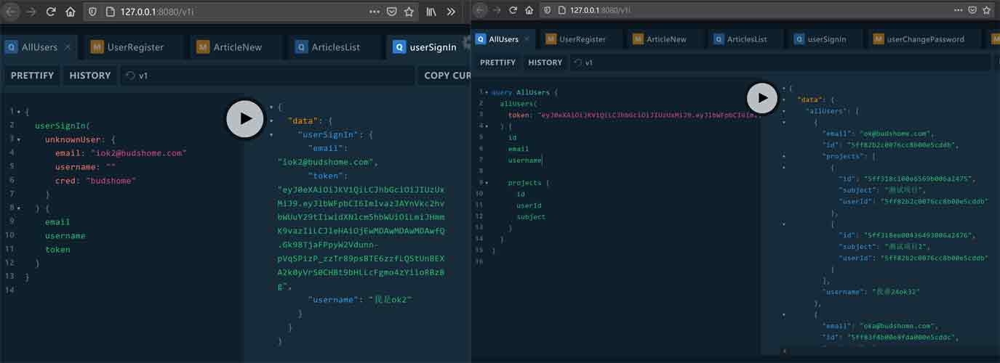

# yazhijia

The **Blog** built on *pure Rust stack*. 

Backend for graphql services using tide, async-graphql, jsonwebtoken, mongodb and so on. 

Frontend for web application using tide, rhai, surf, graphql_client, handlebars-rust, cookie and so on.

## Features

Demo site: [https://blog.budshome.com](https://blog.budshome.com)

## Stacks

- [Rust](https://github.com/rust-lang/rust) - [Rust By Example](https://rust-by-example.budshome.com) and [Cargo Book](https://cargo.budshome.com)
- [Tide](https://crates.io/crates/tide) - [Tide Book](https://tide.budshome.com)
- [rhai](https://crates.io/crates/rhai) - [Embedded Scripting for Rust](https://rhai.budshome.com)
- [async-graphql](https://crates.io/crates/async-graphql) - [async-graphql docs](https://async-graphql.budshome.com)
- [mongodb & mongo-rust-driver](https://crates.io/crates/mongodb)
- [Surf](https://crates.io/crates/surf)
- [graphql_client](https://crates.io/crates/graphql_client)
- [handlebars-rust](https://crates.io/crates/handlebars)
- [jsonwebtoken](https://crates.io/crates/jsonwebtoken)
- [cookie-rs](https://crates.io/crates/cookie)

## How to Build & Run?

- [**Frontend: web application server**](./frontend/README.md)

- [**Backend: graphql servies server**](./backend/README.md)

## Contributing

You are welcome in contributing to the yazhijia project.
