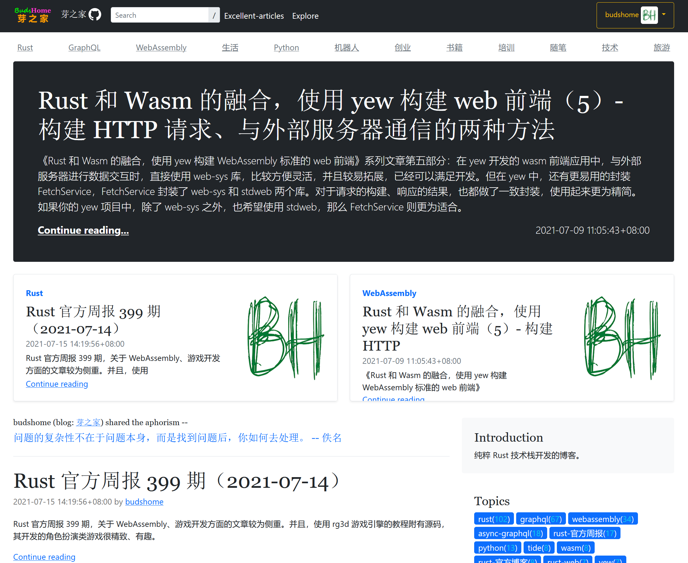

# Web Application Server - handlebars

Demo site: [https://blog.ruonou.com](https://blog.ruonou.com)

## Build & run

``` Bash
git clone https://github.com/zzy/surfer.git
cd surfer
cargo build

cd frontend-handlebars
```

Rename file `.env.example` to `.env`, or put the environment variables into a `.env` file:

```
ADDR=127.0.0.1
PORT=3000

GQL_PROT=http
GQL_ADDR=127.0.0.1
GQL_PORT=8000
GQL_URI=gql
GQL_VER=v1
GIQL_VER=v1i
```

Build & Run:

``` Bash
cargo run
```
Then connect to http://127.0.0.1:3000 with browser.



See also: https://github.com/zzy/tide-async-graphql-mongodb/tree/main/frontend-handlebars

## How to Test & Run `rhai scripts`

You could use `rhai-repl` to test your rhai code, and use `rhai-run` to run it. `rhai-repl.rs` and `rhai-run.rs` are in the folder `frontend-handlebars/scripts`, please copy them into `frontend-handlebars/examples` folder, then test or run rhai code with command:

``` bash 
cargo run --example <rhai-repl>/<rhai-run ./scripts/script_to_run.rhai>
``` 

If you would want to install the rhai tool, use the command 

``` bash
cargo install --path . --example <rhai-repl>/<rhai-run>
```

then test rhai code using `rhai-repl`, and run scripts using the `rhai-run`:

``` bash
rhai-run ./scripts/script_to_run.rhai
```

## Contributing

You are welcome in contributing to this project.
