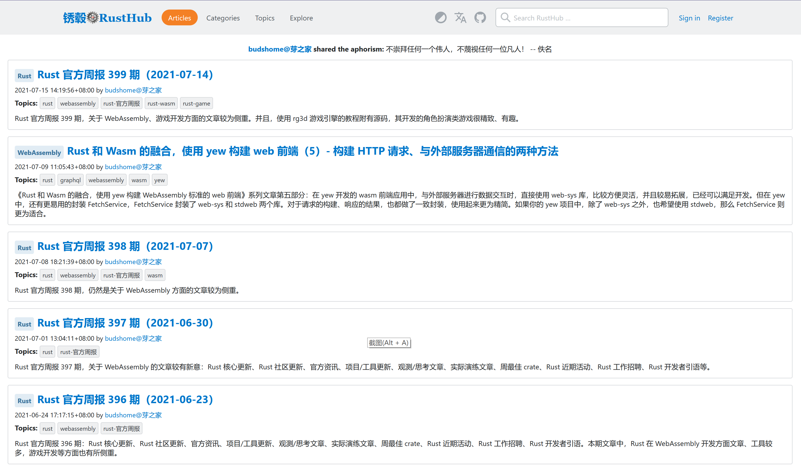

# Web Application Server - yew

Demo site: [https://blog2.ruonou.com](https://blog2.ruonou.com)

## Build & Run:

``` Bash
git clone https://github.com/zzy/surfer.git
cd surfer
cargo build

cd frontend-yew
```

Rename file `.env.toml.example` to `.env.toml`, or put the environment variables into a `.env.toml` file:

``` toml
[site]
title = "<your site's title>"

[gql]
addr = "http://127.0.0.1:8000" # for local test
path = "gql/v1"

[theme_mode]
title = "<your theme title>"
svg = "<your theme svg>"

[i18n]
title = "<your i18n title>"
href = "#"
svg = "<your i18n svg>"

[github]
title = "<your github title>"
href = "//github.com/zzy/surfer"
svg = "<your github svg>"
```

> About **GraphQL API** and **MongoDB data**, read [surfer's intro](../README.md) or [surfer/backend](../backend/README.md).

And then,

``` Bash
cargo install trunk wasm-bindgen-cli

trunk build
trunk serve --release
```
Then connect to http://127.0.0.1:3001 with browser.



See also: https://github.com/zzy/tide-async-graphql-mongodb/tree/main/frontend-yew

## Contributing

You are welcome in contributing to this project.
