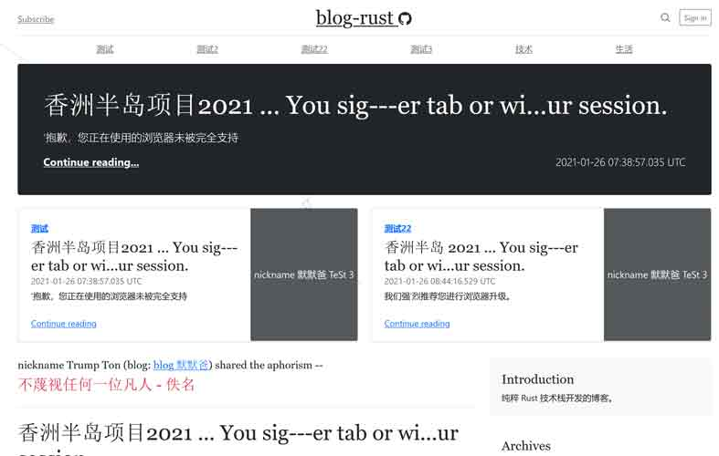

# Web Application Server

## MongoDB data

MongoDB data(include structure & documents) file is `/data/surfer-dev.sql`.

If you need mongodb cloud count, email to me or wechat(微信): yupen-com, please.

## Build & run

``` Bash
git clone https://github.com/zzy/surfer.git
cd surfer
cargo build

cd frontend
```

Rename file `.env.example` to `.env`, or put the environment variables into a `.env` file:

```
ADDR=127.0.0.1
PORT=3000

GQL_PROT=http
GQL_ADDR=127.0.0.1
GQL_PORT=8080
GQL_URI=gql
GQL_VER=v1
GIQL_VER=v1i
```

Build & Run:

``` Bash
cargo run
```
Then connect to http://127.0.0.1:3000 with browser.



## Contributing

You are welcome in contributing to this project.
